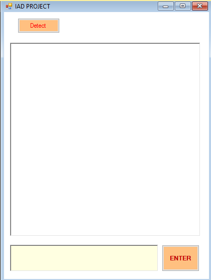

# Auto-server selection application
> It detects the client and choose the chatting server automatically and start chatting service.

### Used Technologies

C#, Visual Studio, Socket programming 

## Description

When client is started in local network. It broadcast packet through local network. If it is detected more than 1 client, clients send packets among clients to measure average RRT time among them. After evaluating performance, best performance client is selected for chatting server. Selected server service chat program among clients. For example, It get the chat from a client, it spread to other clients. 

## Screen Shot


## Installation

Windows:

```sh

```

## Usage example

## Development setup
